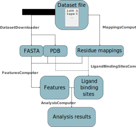

# Pipeline for statistical analysis of ligand binding sites properties
This folder contains implementation of pipeline for analysis of ligand binding sites annotations (hereinafter called features). The pipeline is able to download PDB and FASTA files from PDBe, label binding residues based on the ligands in the PDB file, compute values of defined features, perform **statistical analysis to find out whether these features are interesting for the recognition of binding sites**, and draw various histograms and plots. Furthermore, the extended pipeline can use obtained PDB files and features to train a new model in [P2Rank](http://siret.ms.mff.cuni.cz/p2rank) predictor of binding sites to see if the new features improve the prediction.

Users can define a feature of their own by implementing a method for its computation.

The only needed **input is a dataset file** with proteins.





Below, you can learn how to:
 - [get data and run analysis with predefined features](#one)
 - [add a custom feature](#two)
 - [run analysis on custom data obtained from a different source](#three)
 - [get data and train a P2Rank model with new features](#four)


### Requirements:
* Python 3.x
* BioPython 1.76
* NumPy
* SciPy
* Matplotlib
* P2Rank 2.2 (only for part 3 of the tutorial)

The Python packages can be installed all at once with the [requirement file](https://note.nkmk.me/en/python-pip-install-requirements/) requirements.txt:
```
pip install -r requirements.txt
```

Or the whole virtual environment can be created from the environment.yml file:

```
conda env create -f environment.yml
```

### Setup:
The pipeline requires no installation. First, clone this repository:
```
git clone https://github.com/katebrich/LBS_analysis_pipeline.git
```
Then, go into the new folder:
```
cd LBS_analysis_pipeline
```
Now you can run the pipeline. More examples are described below.
```
python3 scripts/source/analysis_pipeline.py -d data/datasets/test.txt -o output/test
```


<a name="one"></a>
## 1. Downloading data and running analysis
The pipeline can be run with the main script [`analysis_pipeline.py`](./scripts/source/analysis_pipeline.py) that defines the user API.

### Input - Dataset file
We need to specify the **list of structures in the dataset file**. It is a plain-text file where one row equals one structure. The columns are separated by whitespace. The first two columns are mandatory and they contain PDB ID and chain ID (pipeline can only work with single-chain structures). The third column is optional and it can define a list of specific ligands which will be used for ligand binding sites computation.

Example:
- Dataset containing 3 structures:

    ```
    1s69	A
    1do1	A
    1qgw	C
    ```
    
- Dataset with 2 structures where only ligands with specified codes will be considered:

    ```
    1loj	B	URI
    1ja1	A	FAD,NAP,FMN
    ```
Several dataset files can be found [here](./data/datasets)

### Output
All output files are located in an **output root folder** which was specified by argument `-o` or `--output_dir`. 

The root folder structure is as follows:

<a name="folders"></a>
```
output_path
│   run.log  
│
└───PDB
│       1s69A.pdb
│       1do1A.pdb
|       ...  
└───FASTA
|       1s69A.fasta
|       1do1A.fasta
|        ...  
└───mappings    
|       1s69A.txt
|       1do1A.txt
|        ...
└───lbs    
|       1s69A.txt
|       1do1A.txt
|        ...
└───features    
|   |
│   └───feature1
│   |       1s69A.txt
|   |       1do1A.txt
│   |       ...
│   └───feature2
│           1s69A.txt
|           1do1A.txt
│           ...
└───analysis    
    |   binding_ratios.csv
    |   errors.txt
    |   means_difference.csv
    |   p_vals_perc.csv
    |   p_values.csv
    |   p_values_means.csv
    |
    └───feature1
    |       iterations.txt
    |       pairs.txt
    |       p_values.txt
    |       plots, histograms
    |       ...
    └───feature2
            iterations.txt
            pairs.txt
            p_values.txt
            plots, histograms
            ...

```

- Folder `mappings` contains **cached residue mappings**; author residue number (plus insertion code, if any) from the PDB file is in the first column. In the second column, there is PDB molecule number for the residue.
- Folder `lbs` contains **labeling of binding sites**. For each structure, there is a file with one line per residue, where the first number is PDB molecule residue number and the second is label 0/1.
- The subfolders of `features` contain computed **feature values**. Again, the first number is PDB molecule residue number and the second number is the feature value for the residue.
- `analysis` folder contains several summary files. File `errors.txt` lists features where the analysis ended with error. This is often caused by lack of data (e.g. the sample size is bigger than number of rows or the data for a categorical feature are too sparse to meet the assumptions of Chi-squared test). Detailed information about the errors can be found in log.
- Furthermore, there are more statistics and graphs in separate folders for every feature. `pairs.txt` file contains **paired ligand binding sites labels with feature values** for all the structures in the dataset. It could be useful for more analysis or e.g. for training and testing a classifier.
- File `run.log` is copied to the output directory when the program terminates. This is the **detailed log**; the brief log is printed to the console as the program runs.

### Options and Arguments

```
Usage: analysis_pipeline.py -d DATASET_FILE_PATH -o OUTPUT_DIR_PATH [OPTIONS]... 

Options:
  -d, --dataset                Mandatory; file with listed structures to process.
  -o, --output_dir             Mandatory; root folder. Created if not exists.
  -t, --tasks                  Default: 'A'. Comma-separated list of tasks to process. If data are missing in root folder for some task, they are computed even if their task is not in the list. Possible values: 'D' - download; 'L' - compute ligand binding sites; 'F' - compute features; 'A' - compute analysis
  -m, --threads                Default: 4. Number of threads.
  -f, --features               Comma-separated list of features. If not provided, all features from config are processed.
  -c, --config_path            Default: file config.json located in the same directory as this script.
  -l, --lbs_distance_threshold Default: 4. Binding residues are defined as residues with at least one non-hydrogen atom in distance at most lbs_binding_threshold from any ligand.
  -s, --sample_size            Default: 0. Size of random sample for hypothesis tests. If 0, all rows are taken. Arguments -i and -b are not considered, as this only makes sense for 1 iteration and no balancing.
  -i, --iterations             Default: 1. Number of iterations of hypothesis tests. Summary files contain averaged results from all the iterations.
  -b, --balance_binding_ratio  Default: False. If false, sample of given size is taken from the whole dataset and binding/nonbinding ratio is not balanced. If true, the same number of binding rows and nonbinding rows (equal to given sample size) is taken. 
  -p, --draw_plots             Default: True.
  -a, --alpha                  Default: 0.05. Statistical significance level. 


```

### Examples
We will show the usage on a short test dataset [test.txt](./data/datasets/test.txt) of 10 proteins. You can replace it with any [pre-defined dataset
](../data/datasets/) or with your own file. 

First, go to cloned repository:
```
cd LBS_analysis_pipeline
```

Then run the pipeline:

```
python3 scripts/source/analysis_pipeline.py -d data/datasets/test.txt -o output/test
```
This is the **basic usage**. It downloads all the structures, computes binding sites, all features defined in config, and analysis of those features. By default, the analysis is computed for all the data rows. The random sampling can be done by **specifying the sample size and number of iterations**:

```
python3 scripts/source/analysis_pipeline.py -d data/datasets/test.txt -o output/test -s 500 -i 10
```
In the example above, in each iteration, 500 rows will be randomly sampled from the whole dataset. If we want to **take the same number of binding and nonbinding rows**, we need to set the balance_binding_ratio to true. In the following example, the analysis will be computed with 500 binding rows AND 500 nonbinding rows.

```
python3 scripts/source/analysis_pipeline.py -d data/datasets/test.txt -o output/test -s 500 -i 10 -b true
```
In all the examples above, the analysis was computed for all the features in the config file. It is possible to **specify a subset of features**:
```
python3 scripts/source/analysis_pipeline.py -d data/datasets/test.txt -o output/test -f hydropathy,aromaticity
```
We could need to **compute only some parts of the pipeline**, for example ligand bingind sites. This can be done by specifying particular task. The pipeline computes only data needed for this task. The following command downloads data, computes mappings and ligand binding sites, but does not compute any feature values or analysis, because these computations are not needed for the main task ('L' - ligand binding sites):
```
python3 scripts/source/analysis_pipeline.py -d data/datasets/test.txt -o output/test -t L
```

### Notes

- Most data is downloaded from databases (PDBe, UniProt, PDBe-KB). Sometimes, it can happen that the database is overloaded or temporarily unavailable. Also, some feature values are not available for all the structures (e.g. the protein is not in UniProt and the feature values are downloaded from there). You will get an **error message for these faulty structures and the program skips them and continues**. At the end of each task, there is a warning message listing all the faulty structures:
```
2020-12-01 10:42:48,162 [ERROR] DatasetDownloader.py(line 114) 1/14: 1cbs A NOT PROCESSED ! See log for more details.
2020-12-01 10:42:48,379 [ERROR] DatasetDownloader.py(line 114) 2/14: 1kae X NOT PROCESSED ! See log for more details.
2020-12-01 10:43:07,107 [WARNING] DatasetDownloader.py(line 59) Downloading structures finished in 20s. 2/14 structures were not downloaded successfully: 
1cbs A
1kae X

```

<a name="two"></a>
## 2. Defining new features
User can define a custom feature and implement a method for getting the values.
**Two steps** need to be made:
- add feature to the **[config file]**(scripts/source/config.json)
  - **import_path**: path to the implementation. The class is loaded dynamically according to the feature name.
  - **type**: binary, categorical, ordinal or continuous. Hypothesis test is chosen according to the type (Welch's test for continuous and Chi-squared test for the rest). Plots can also differ according to the type.
  - **default**: optional. It is needed when creating feature files for P2Rank (described in section [four](#four)). It specifies the default value for rows where the value is missing.
- **implement** class with method `get_values(self, data_dir, pdb_id, chain_id)`. It can be located anywhere (the path to the class is provided in the config); however, there is a prepared script [`Custom.py`](scripts/source/Features/Custom.py) for this purpose, with an example implementation.

If you don't want to add the custom feature to the existing ones, you can create a new config file and pass it as argument:
```
python3 scripts/source/analysis_pipeline.py -d data/datasets/test.txt -o output/test -c **new_config_path**
```

<a name="three"></a>
## 2. Running analysis on custom data
By specifying a task, we tell the program what is the desired output. The program **automatically decides what else is needed to compute for this task**. For example, if the task is 'L' (ligand binding sites computation), the program checks the existence of folders 'PDB' and 'mappings' (see the [folder structure](#folders) above). If they don't exist, the tasks 'D' (download) and 'M' (mappings) are automatically processed before binding sites computation.

Thus, if you already have some data already downloaded/computed, you can **run the pipeline with them by putting them into the correct folders**.
Note that the folders hierarchy and naming, as well as naming of the files (pbdID+chainID.txt/.pdb/.fasta) and correct formatting of the files **must be kept the same** as if it were obtained from the pipeline!

The **dependencies** of the tasks are following (as shown in the diagram above)
- D: no dependencies
- M: no dependencies
- L: D,M
- F: D,M
- A: F,L

### Example
Let's say **we have values for a feature named 'XXX' and we also have ligand binding sites already computed**. We want to compute the statistical analysis.
We need to create a directory 'features' with subdirectory 'XXX' and put the files with feature values there, one file per structure. The file for structure 1cbs, chain A will be named '1cbsA.txt'. The file will contain the feature values, one line per residue, where the first column will be the residue number (in fact in can be any numbering, the values of ligand binding sites will be paired with the values of the feature according to this numbering) and the second column will be the feature value for the residue. 
We do the same thing for ligand binding sites values - create a directory 'lbs' and put there files for all the structure.
Then, we run this command:
```
python3 scripts/source/analysis_pipeline.py -d data/datasets/test.txt -o output/test -t A
```
where 'output/test' is the directory which contains subdirectories 'features' and 'lbs' with files in correct format. The program **should recognize that these folders already exist** and it should compute the analysis only.

<a name="four"></a>
## 3. Training a P2Rank model

**P2Rank** (TODO - more info about the software) has an interface for **adding custom features** and training new models with these features. The way to do that is described in the [tutorial](https://github.com/cusbg/p2rank-framework/wiki/P2Rank-Custom-Feature).

In this folder, you will find **two scripts that further extend the analysis pipeline** and allow you to automatically train P2Rank models with obtained data. The scripts first run the pipeline - download the data, compute ligand binding sites, features and analysis, as in previous sections. In addition, dataset files are converted to the format accepted by P2Rank, the .csv files with custom features are created using previously computed feature values, and **P2Rank model is trained and evaluated on given datasets with custom features**.

It is possible either to train one model with **all given features at once** ([`pipeline_P2Rank_allFeatures.sh`](scripts/pipeline_P2Rank_allFeatures.sh)) or to train **one model per feature** ([`pipeline_P2Rank_oneFeature.sh`](scripts/pipeline_P2Rank_oneFeature.sh). We will show the latter in the example; however, the usage is exactly the same for the both scripts.

**NOTE! Before usage, you need to change the `P2RANK_PATH` variable in the scripts according to your P2Rank installation directory!**


```
bash scripts/pipeline_P2Rank_oneFeature.sh -t data/datasets/chen11.txt -e data/datasets/coach420.txt -f pdbekb_conservation,depth -l 1 -m 4
```

In this example, the whole analysis pipeline is calculated for the both datasets. The P2Rank model is trained and evaluated using `traineval` command (see P2Rank tutorial) twice - for feature pdbekb_conservation and depth separately.


